# 🌾 AgroNet-4-BHARAT 🚜  
**Smart, Scalable, and Automated IoT-Based Precision Agriculture System for Indian Farmers**

---

## 🌟 Overview

AgroNet-4-BHARAT aims to revolutionize Indian agriculture by deploying a **Smart IoT-Based Farming System** that maximizes resource efficiency, enhances crop productivity, and fosters sustainability. By integrating **real-time monitoring**, **automated irrigation**, and **predictive analytics**, the system empowers farmers to make **data-driven decisions** with ease and reliability.

This project uses **ESP8266 microcontrollers**, environmental **IoT sensors**, **cloud-native containerization**, and **machine learning** to monitor and manage **soil moisture, temperature, and water usage**. AgroNet-4-BHARAT is designed to scale with ease, making it a robust solution for **small-scale farms** and **large agricultural estates** alike.

---

## 📦 Features

- 🌐 Wi-Fi Enabled ESP8266 Controllers for real-time communication
- 📊 Cloud-based Analytics for storing and processing sensor data
- 🌱 Soil Health and Environmental Monitoring using temperature and soil moisture sensors
- 🤖 AI-Driven Irrigation Predictions based on historical and real-time data
- 🔁 Automated Water Dispensing System triggered by AI decisions
- 🧱 Containerized Codebase for plug-and-play ESP8266 deployment
- 📋 Interactive Web Dashboard for visualization, control, and node provisioning

---

## ⚙️ Technologies Used

| Category              | Technology                         |
|-----------------------|-------------------------------------|
| Microcontroller       | ESP8266 NodeMCU                     |
| Sensors               | Soil Moisture Sensor, DHT11/DHT22   |
| Communication         | MQTT, HTTP REST APIs                |
| Backend               | Python (Flask/FastAPI), Node.js     |
| Containerization      | Docker, Docker Compose              |
| Orchestration         | Kubernetes, Minikube/K3s            |
| Database              | InfluxDB, PostgreSQL                |
| Machine Learning      | Scikit-learn, TensorFlow/TFLite     |
| Frontend Dashboard    | React.js / Next.js, TailwindCSS     |
| Visualization         | Chart.js, Recharts                  |
| Monitoring & Logging  | Prometheus, Grafana, Loki           |

---

## 🏠 System Architecture

---

## 🧱 Scaling and Automation Strategy

### 🔄 Containerization
- Each ESP8266 controller's firmware logic is encapsulated in a **Docker container**.
- When a farmer adds a new board, the backend **provisions** the correct image and performs **Over-The-Air (OTA)** deployment.

### ☁️ Kubernetes Integration
- Kubernetes handles the **orchestration** of microservices.
- Features include:
  - Load balancing and autoscaling
  - Health checks and service discovery
  - Secure environment management via ConfigMaps and Secrets

### 🤖 AI Model Automation
- Machine learning model predicts future soil moisture based on:
  - Real-time sensor inputs
  - Weather data
  - Past irrigation records
- This model:
  - Sends irrigation triggers to control service
  - Updates dashboard forecasts
  - Adapts continuously based on new data

---

## 🧠 AI Model Details

| Feature                 | Data Source                    |
|-------------------------|---------------------------------|
| Soil Moisture           | ESP8266 with sensors            |
| Temperature & Humidity  | DHT11/DHT22                     |
| Weather Forecast        | External Weather APIs           |
| Irrigation Schedule     | System and user-defined logs    |

- **Model Type:** Random Forest / LSTM
- **Framework:** Scikit-learn / TensorFlow Lite
- **Deployment:** REST API container service

---

## 💻 Dashboard Features

- ✅ **Live Monitoring** of all connected ESP8266 nodes
- 🌡️ Real-Time **Soil Moisture and Temperature Graphs**
- 📈 **Historical Analytics** with predictive trends
- 🧠 Display of **AI Recommendations** and irrigation status
- ➕ Add New Boards at the press of a button (OTA provisioning)
- 🔧 **Manual Override** to control irrigation
- 🗘️ **Geo-tagged Farm View** to visualize deployment layout
- 🔔 Alert System for low moisture levels, sensor failure, or irrigation errors

---

## 📊 Future Enhancements

- ☄️ Integration with satellite and external weather APIs for precision
- 🚀 LoRa or NB-IoT compatibility for rural, non-Wi-Fi zones
- 🧠 Federated learning for decentralized, privacy-respecting model training
- 📲 Progressive Web App (PWA) dashboard for offline use
- ⛅️ Edge ML inference using ESP32 + TensorFlow Lite
- 🔒 Blockchain-based logging for transparent farm data audits

---

## 🤝 Contributing

We welcome contributions from the community! Whether you're a developer, researcher, farmer, or student — your insights are valuable.

### How to Contribute:
1. Fork the repository
2. Create your feature branch: `git checkout -b my-feature`
3. Commit your changes: `git commit -am 'Add new feature'`
4. Push to the branch: `git push origin my-feature`
5. Submit a Pull Request

Please see `CONTRIBUTING.md` for more details.

---

## 📄 License

This project is licensed under the **MIT License**.  
Please refer to the [LICENSE](./LICENSE) file for more information.

---

## 🏁 Acknowledgments

- The farmers and agritech innovators of India 🇮🇳  
- Open-source contributors and communities (ESPHome, Mosquitto, Prometheus, etc.)  
- Engineers and scientists building sustainable, data-driven futures  
- You, for being part of this mission to cultivate innovation 🌾

> *"Let us cultivate not just crops, but knowledge and technology."*

